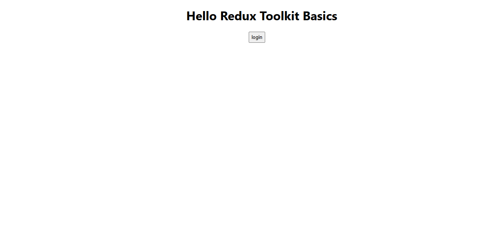
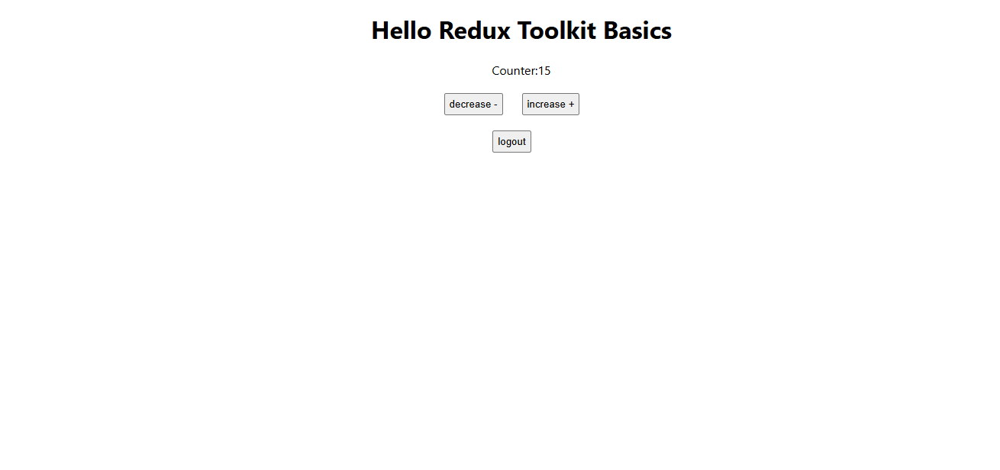

# react-reduxtoolkit-kimz-ola

This is a simple project to learn and practice redux-toolkit with react"Hooks" built with ReactJs [function-component]. 

## Table of contents

- [Overview](#overview)
- [Features](#Features)
- [Installation](#Installation)
- [Usage](#Usage)
- [Links](#Links)
- [Screenshot](#Screenshot)
- [Author](#author)


## overview
This is a simple project to learn and practice redux-toolkit with react"Hooks" built with ReactJs [function-component]. 

## Features
- how to deel with useSelector-useDispatch

## Installation
To get started with this project, follow these steps:

you can clone the project or download it as Zip file.
1. Clone the repository:
   ```bash
   git clone https://github.com/olahasan/react-reduxtoolkit-kimz-ola.git

2. Navigate to the project directory:
   cd <project-directory>

3. Install the required dependencies:
   npm install   


## Usage
To run the application, use the following command:

npm start


## Links

If you want to open the link in a new tab, you can:

- Press **Ctrl** (or **Cmd** on Mac) while clicking the link.
- Right-click the link and select **Open link in new tab**.

Otherwise, all links will open in the same tab.


- Solution URL: [here](https://github.com/olahasan/react-reduxtoolkit-kimz-ola)

- Live Site URL: [here](https://react-reduxtoolkit-kimz-ola.surge.sh/) OR [here](https://react-reduxtoolkit-kimz-ola.netlify.app/)

 ## Screenshot
 




### Author

GitHub - @olahasan

